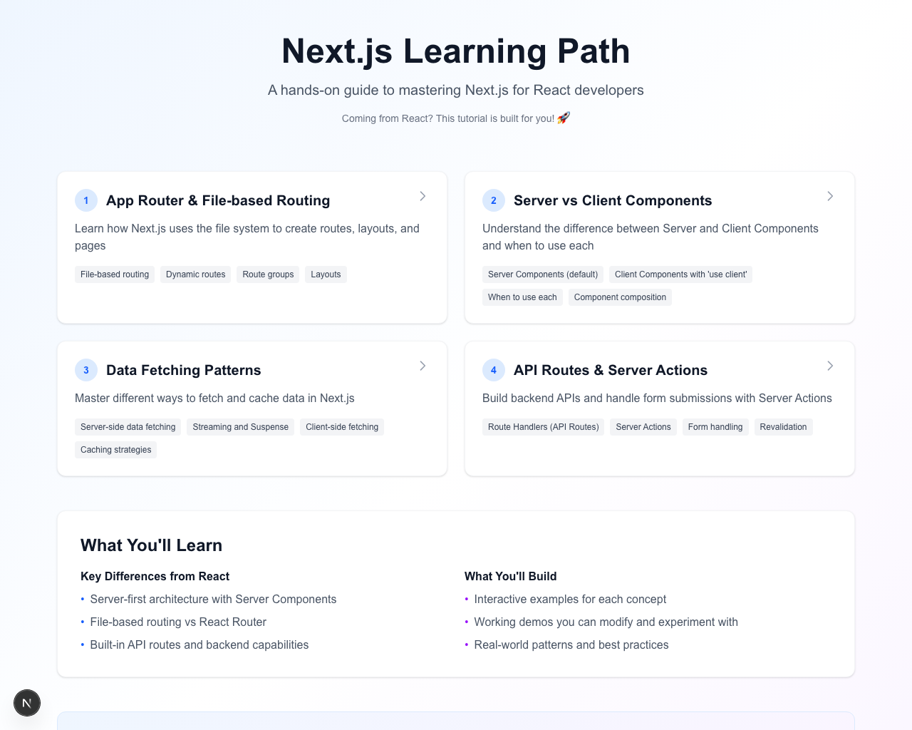
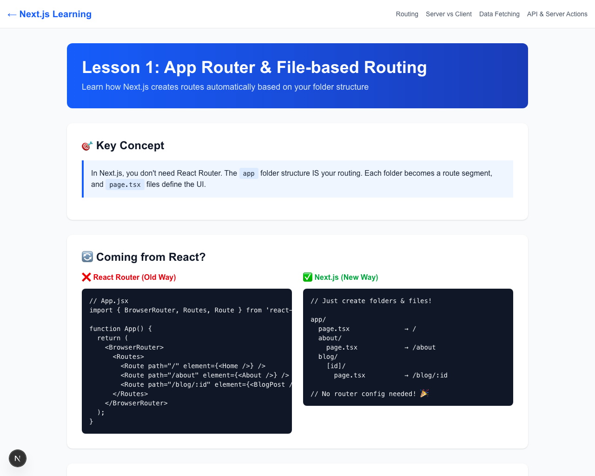
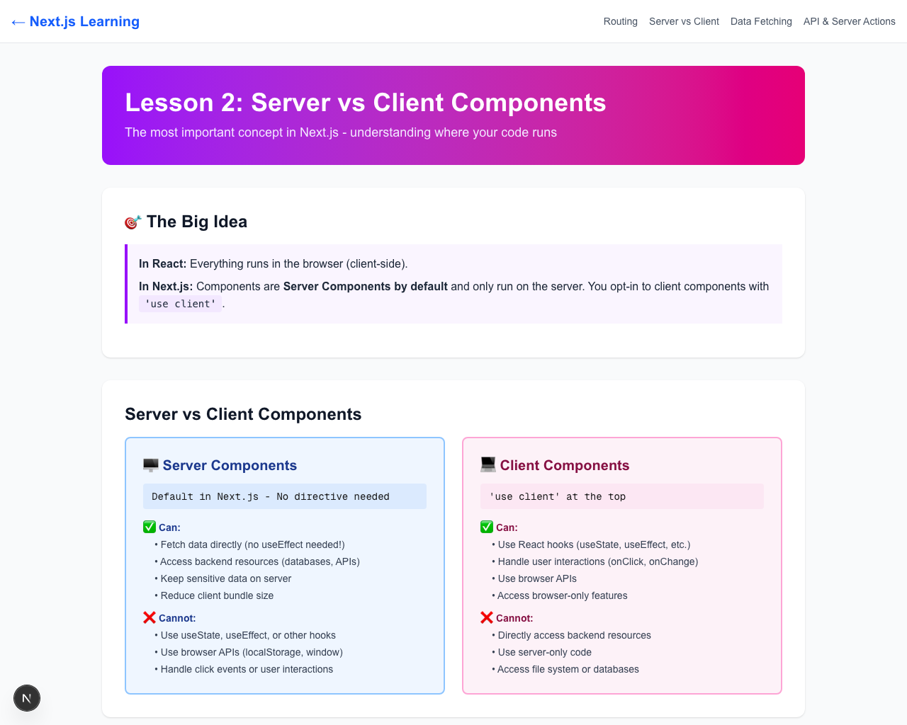

# Next.js Learning App 🚀

An interactive, hands-on tutorial app designed to help React developers learn Next.js. Built for developers who want to master Next.js fundamentals through practical examples.

## 🌐 Live Demo

**[👉 Try it now: https://nextjs-learning-app-gold.vercel.app](https://nextjs-learning-app-gold.vercel.app)**

No installation needed - start learning Next.js right away!

## 📸 Screenshots

<div align="center">

### Homepage

*Interactive lesson cards with clear navigation and learning objectives*

### Lesson: App Router & File-based Routing

*Learn file-based routing with side-by-side comparisons and live examples*

### Lesson: Server vs Client Components

*Interactive demos showing the difference between server and client components*

</div>

## 🎯 What You'll Learn

This app covers the most important Next.js concepts through interactive lessons with live code examples:

1. **App Router & File-based Routing** - Understand Next.js's file-system based routing
2. **Server vs Client Components** - Master the difference and when to use each
3. **Data Fetching Patterns** - Learn server-side data fetching, caching, and Suspense
4. **API Routes & Server Actions** - Build fullstack apps with backend endpoints

## ✨ Features

- 📚 4 comprehensive lessons with clear explanations
- 💻 Side-by-side comparisons of React vs Next.js approaches
- 🎨 Interactive demos and live examples
- 🔥 Real API calls and working code you can experiment with
- 🎓 Designed for React developers transitioning to Next.js

## 🚀 Getting Started

### Prerequisites

- Node.js 18+ installed
- Basic knowledge of React

### Installation

```bash
# Clone the repository
git clone <your-repo-url>
cd nextjs-learning-app

# Install dependencies
npm install

# Run the development server
npm run dev
```

Open [http://localhost:3000](http://localhost:3000) in your browser to start learning!

## 📖 Lessons Overview

### Lesson 1: App Router & File-based Routing
Learn how Next.js eliminates the need for React Router by using your folder structure as routes. Understand dynamic routes, layouts, and special files.

**Key Topics:**
- File-based routing fundamentals
- Dynamic routes with `[param]`
- Nested routes and layouts
- Special files (`page.tsx`, `layout.tsx`, `loading.tsx`, etc.)

### Lesson 2: Server vs Client Components
Understand the most fundamental concept in Next.js - where your components run and why it matters.

**Key Topics:**
- Server Components (default behavior)
- Client Components with `'use client'`
- When to use each type
- Component composition patterns

### Lesson 3: Data Fetching Patterns
Master the powerful data fetching capabilities that make Next.js special - no more useEffect for data fetching!

**Key Topics:**
- Server-side data fetching with async/await
- Caching strategies (static, dynamic, revalidate)
- Streaming with Suspense
- Client-side fetching when needed

### Lesson 4: API Routes & Server Actions
Build fullstack applications by creating backend APIs and handling forms directly in Next.js.

**Key Topics:**
- Route Handlers (API endpoints)
- Server Actions for form handling
- Revalidation strategies
- When to use Routes vs Actions

## 🛠️ Built With

- [Next.js 16](https://nextjs.org/) - React framework
- [React 19](https://react.dev/) - UI library
- [TypeScript](https://www.typescriptlang.org/) - Type safety
- [Tailwind CSS](https://tailwindcss.com/) - Styling

## 📦 Project Structure

```
nextjs-learning-app/
├── app/
│   ├── page.tsx                    # Home page with lesson overview
│   ├── layout.tsx                  # Root layout
│   ├── lessons/
│   │   ├── layout.tsx             # Lessons navigation layout
│   │   ├── routing/               # Lesson 1
│   │   ├── server-client/         # Lesson 2
│   │   ├── data-fetching/         # Lesson 3
│   │   └── api-server-actions/    # Lesson 4
│   └── api/
│       └── hello/                 # Example API route
├── public/                        # Static assets
└── package.json
```

## 🤝 Contributing

Contributions are welcome! If you have suggestions for improvements or additional lessons:

1. Fork the repository
2. Create a feature branch (`git checkout -b feature/amazing-lesson`)
3. Commit your changes
4. Push to the branch
5. Open a Pull Request

## 💡 For Learners

- Take your time with each lesson
- Experiment with the code - modify examples to see what happens
- Use the browser's developer tools to inspect network requests
- Read the inline code comments for additional insights

## 📝 License

This project is open source and available under the [MIT License](LICENSE).

## 👨‍💻 About the Author

Created by **Xiao He**, a developer passionate about helping others learn modern web development.

**Connect with me:**
- 🐙 GitHub: [@hexiao0225](https://github.com/hexiao0225)
- 💼 LinkedIn: [Xiao He](https://www.linkedin.com/in/xiaohe0225/)

Feel free to reach out with questions, suggestions, or just to connect! I'd love to hear your feedback and help you on your Next.js learning journey.

## 🌟 Acknowledgments

Created to help developers transition from React to Next.js with clear explanations, side-by-side comparisons, and practical examples.

## 🔗 Resources

- [Next.js Documentation](https://nextjs.org/docs)
- [React Documentation](https://react.dev)
- [Next.js Learn Course](https://nextjs.org/learn)

---

Made with ❤️ for the developer community. Happy learning!
